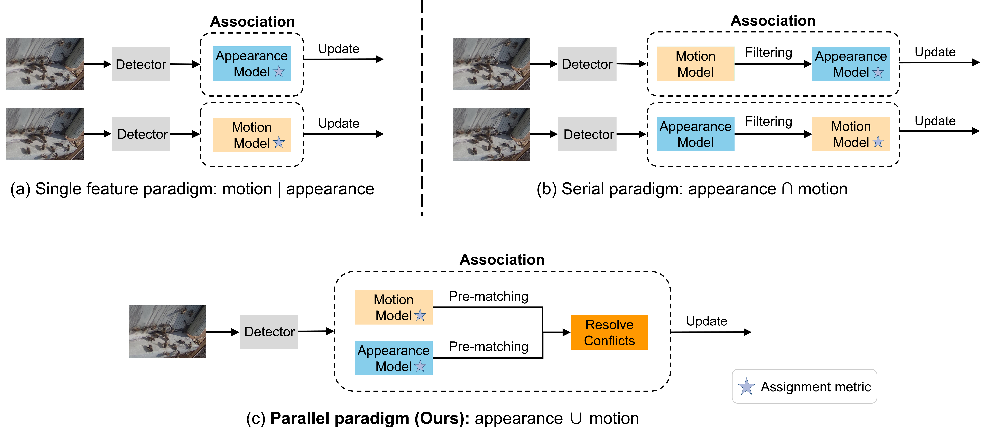

# (IEEE TIP) TOPIC: A Parallel Association Paradigm for Multi-Object Tracking under Complex Motions and Diverse Scenes

TOPICTrack proposes a **_parallel association paradigm_**, can take full advantage of motion and appearance features.

<p align="center"></p>

> [**TOPIC: A Parallel Association Paradigm for Multi-Object Tracking under Complex Motions and Diverse Scenes**](https://ieeexplore.ieee.org/document/10851814)
>
> Xiaoyan Cao, Yiyao Zheng, Yao Yao, Huapeng Qin, Xiaoyu Cao and Shihui Guo
>
> _[IEEE TIP](https://ieeexplore.ieee.org/document/10851814)_

## News ✨
- (2025.03) Currently reviewing some issues, updates will be available soon~
- (2025.02) Our ``code`` and ``dataset`` have been invited for publication on the ``wisemodel.cn`` open-source platform. Please see [code](https://wisemodel.cn/codes/holmescao/TOPICTrack/) and [data](https://wisemodel.cn/datasets/holmescao/BEE24/).
- (2025.02) **a.** Code update from BEE23 to BEE24; fixed some issues; **b.** we will conduct comprehensive testing to ensure the reproducibility of experimental results; **c.** feel free to submit issues~
- (2025.01) Our paper is online! Please see [IEEE](https://ieeexplore.ieee.org/document/10851814).
- (2024.12) TOPICTrack is accepted by IEEE TIP! 🎊🎊🎊
- (2024.10) We expanded the dataset by an order of magnitude, renamed it to BEE24, and made it available at: https://holmescao.github.io/datasets/BEE24.
- (2023.08) We provide a complete reproduction tutorial and release the proposed [BEE23](https://drive.google.com/file/d/1kcq3wV-sjr8H_HGNoefaGr_nx7OlVfPo/view) dataset as a new benchmark.

## Abstract

Video data and algorithms have been driving advances in multi-object tracking (MOT). While existing MOT datasets focus on occlusion and appearance similarity, complex motion patterns are widespread yet overlooked. To address this issue, we introduce a new dataset called BEE24 to highlight complex motions. Identity association algorithms have long been the focus of MOT research. Existing trackers can be categorized into two association paradigms: single-feature paradigm (based on either motion or appearance feature) and serial paradigm (one feature serves as secondary while the other is primary). However, these paradigms are incapable of fully utilizing different features. In this paper, we propose a parallel paradigm and present the Two rOund Parallel matchIng meChanism (TOPIC) to implement it. The TOPIC leverages both motion and appearance features and can adaptively select the preferable one as the assignment metric based on motion level. Moreover, we provide an Attention-based Appearance Reconstruction Module (AARM) to reconstruct appearance feature embeddings, thus enhancing the representation of appearance features. Comprehensive experiments show that our approach achieves state-of-the-art performance on four public datasets and BEE24. Moreover, BEE24 challenges existing trackers to track multiple similar-appearing small objects with complex motions over long periods, which is critical in real-world applications such as beekeeping and drone swarm surveillance. Notably, our proposed parallel paradigm surpasses the performance of existing association paradigms by a large margin, e.g., reducing false negatives by 6% to 81% compared to the single-feature association paradigm. The introduced dataset and association paradigm in this work offer a fresh perspective for advancing the MOT field.

## Tracking performance

### Results on five benchmarks test set

| Dataset    | HOTA | MOTA | IDF1 | AssA | AssR | FP     | FN      | IDs   | Frag  |
| ---------- | ---- | ---- | ---- | ---- | ---- | ------ | ------- | ----- | ----- |
| MOT17      | 63.9 | 78.8 | 78.7 | 64.3 | 69.9 | 17,000 | 101,100 | 1,515 | 2,613 |
| MOT20      | 62.6 | 72.4 | 77.6 | 65.4 | 70.3 | 11,000 | 131,100 | 869   | 1,574 |
| DanceTrack | 58.3 | 90.9 | 58.4 | 42.3 | 48.1 | 5,555  | 19,246  | 1,471 | 2,106 |
| GMOT-40    | 84.7 | 96.6 | 92.5 | 82.7 | 84.9 | 205    | 327     | 335   | 92    |
| BEE24      | 46.6 | 66.7 | 59.7 | 40.3 | 59.1 | 29,171 | 25,691  | 1,401 | 2,490 |

### Visualization results on five benchmarks test set

<p align="center"></p>
<p align="center"></p>

## Installation

- Install Python dependencies. We utilize Python 3.8 and PyTorch 1.8.0.

  ```
  git clone https://github.com/holmescao/TOPICTrack
  cd TOPICTrack
  conda create -n TOPICTrack python=3.8
  conda activate TOPICTrack
  pip install --upgrade pip
  pip install torch==1.8.0+cu111 torchvision==0.9.0+cu111 torchaudio==0.8.0 -f https://download.pytorch.org/whl/torch_stable.html
  cd external/YOLOX/
  pip install -r requirements.txt && python setup.py develop
  cd ../deep-person-reid/
  pip install -r requirements.txt && python setup.py develop
  cd ../fast_reid/
  pip install -r docs/requirements.txt
  ```

## Data preparation

### For detector and tracking

Download [MOT17](https://motchallenge.net/), [MOT20](https://motchallenge.net/), [DanceTrack](https://drive.google.com/drive/folders/1ASZCFpPEfSOJRktR8qQ_ZoT9nZR0hOea), [GMOT-40](https://spritea.github.io/GMOT40/download.html), [BEE24](https://holmescao.github.io/datasets/BEE24) and put them under <TOPICTrack_HOME>/data in the following structure:

```
data
|-- mot
|   |-- test
|   |-- train
|-- MOT20
|   |-- test
|   |-- train
|-- dancetrack
|   |-- test
|   |-- train
|   |-- val
|-- gmot
|   |-- test
|   |-- train
|-- BEE24
    |-- test
    |-- train
```

Note that the GMOT-40 contains 4 categories with 10 sequences each. Since the official description does not split the training and test sets for these sequences, this work treats 3 of them (sequentially numbered 0,1,3) for each category as the training set and the remaining 1 (sequentially numbered 2) as the test set.

Then, you need to turn the datasets to COCO format:

```shell
cd <TOPICTrack_HOME>
python3 tools/convert_mot17_to_coco.py
python3 tools/convert_mot20_to_coco.py
python3 tools/convert_dance_to_coco.py
python3 tools/convert_gmot_to_coco.py
python3 tools/convert_bee_to_coco.py
```

### For Re-ID model

Download [GMOT-40-reid](https://drive.google.com/file/d/16zglooRN-XgAK9onV8QpAZGjk1mRK48L/view?usp=sharing), [BEE24-reid](https://drive.google.com/file/d/1e2DpuUCrZq1cd-MCbhP0a2QrZLZlOi9P/view?usp=sharing) and put them under <TOPICTrack_HOME>/fast-reid/datasets in the following structure:

```
datasets
|-- BEE24
|   |-- bounding_box_test
|   |-- bounding_box_train
|   |-- query
|-- gmot
    |-- bounding_box_test
    |-- bounding_box_train
    |-- query
```

Here we use [Deep-OC-SORT](https://github.com/GerardMaggiolino/Deep-OC-SORT/) trained Re-ID models on [MOT17](https://drive.google.com/file/d/1MMfyl6H8htvbUBnSp2OtByI_Cofh-cy7/view?usp=drive_link), [MOT20](https://drive.google.com/file/d/1pSzcJTTeHWIE_28-fwqh8cdshmL0FS22/view?usp=drive_link), and [DanceTrack](https://drive.google.com/file/d/1grM0Al3y83TJ8g6nddbFEKx7PpAO0MU8/view?usp=drive_link).

## Model zoo

We provide some pretrained YOLO-X weights and FastReID weights for TOPICTrack.

Please download the required pre-trained weights by yourself and put them into `external/weights`. Besides, the password for all the Baidu Cloud links is `topi`.

| Dataset         | HOTA | MOTA | IDF1 | FP     | FN      | Model (Detection)                                                                                                                                                                | Model (Re-ID)                                                                                                                                                          |
| --------------- | ---- | ---- | ---- | ------ | ------- | -------------------------------------------------------------------------------------------------------------------------------------------------------------------------------- | ---------------------------------------------------------------------------------------------------------------------------------------------------------------------- |
| MOT17-half-val  | 69.6 | 79.8 | 81.2 | 3,028  | 7,612   | topictrack_ablation.pth.tar [[google](https://drive.google.com/drive/folders/16GETvgDgDBUHVT-rwTzIhCbX8bSA8bxN)] [[baidu:topi](https://pan.baidu.com/s/1-RcDIE85-doGJz50U4pNFg)] | mot17_sbs_S50.pth [[google](https://drive.google.com/drive/folders/16GETvgDgDBUHVT-rwTzIhCbX8bSA8bxN)] [[baidu:topi](https://pan.baidu.com/s/1CLY6Q6qyVHPc3JviPvZjBQ)] |
| MOT17-test      | 63.9 | 78.8 | 78.7 | 17,000 | 101,100 | topictrack_mot17.pth.tar [[google](https://drive.google.com/drive/folders/16GETvgDgDBUHVT-rwTzIhCbX8bSA8bxN)] [[baidu:topi](https://pan.baidu.com/s/1PNjquCVh-32IJJ283syCCg)]    | mot17_sbs_S50.pth [[google](https://drive.google.com/drive/folders/16GETvgDgDBUHVT-rwTzIhCbX8bSA8bxN)] [[baidu:topi](https://pan.baidu.com/s/1CLY6Q6qyVHPc3JviPvZjBQ)] |
| MOT20-half-val  | 57.5 | 73.0 | 73.6 | 28,583 | 135,945 | topictrack_mot17.pth.tar [[google](https://drive.google.com/drive/folders/16GETvgDgDBUHVT-rwTzIhCbX8bSA8bxN)] [[baidu:topi](https://pan.baidu.com/s/1PNjquCVh-32IJJ283syCCg)]    | mot20_sbs_S50.pth [[google](https://drive.google.com/drive/folders/16GETvgDgDBUHVT-rwTzIhCbX8bSA8bxN)] [[baidu:topi](https://pan.baidu.com/s/1N40I7Y0v73eWTpG0mBJ1Hw)] |
| MOT20-test      | 62.6 | 72.4 | 77.6 | 11,000 | 131,100 | topictrack_mot20.pth.tar [[google](https://drive.google.com/drive/folders/16GETvgDgDBUHVT-rwTzIhCbX8bSA8bxN)] [[baidu:topi](https://pan.baidu.com/s/117V_e6b4do9PVr6zcKfzew)]    | mot20_sbs_S50.pth [[google](https://drive.google.com/drive/folders/16GETvgDgDBUHVT-rwTzIhCbX8bSA8bxN)] [[baidu:topi](https://pan.baidu.com/s/1N40I7Y0v73eWTpG0mBJ1Hw)] |
| DanceTrack-val  | 55.7 | 89.3 | 54.2 | 12,636 | 10,567  | topictrack_dance.pth.tar [[google](https://drive.google.com/drive/folders/16GETvgDgDBUHVT-rwTzIhCbX8bSA8bxN)] [[baidu:topi](https://pan.baidu.com/s/12c7WYTavSz8W0AvSiqjODA)]    | dance_sbs_S50.pth [[google](https://drive.google.com/drive/folders/16GETvgDgDBUHVT-rwTzIhCbX8bSA8bxN)] [[baidu:topi](https://pan.baidu.com/s/1m7hp0LVVNYMq47ks8HqZ5A)] |
| DanceTrack-test | 58.3 | 90.9 | 56.6 | 5,555  | 19,246  | topictrack_dance.pth.tar [[google](https://drive.google.com/drive/folders/16GETvgDgDBUHVT-rwTzIhCbX8bSA8bxN)] [[baidu:topi](https://pan.baidu.com/s/12c7WYTavSz8W0AvSiqjODA)]    | dance_sbs_S50.pth [[google](https://drive.google.com/drive/folders/16GETvgDgDBUHVT-rwTzIhCbX8bSA8bxN)] [[baidu:topi](https://pan.baidu.com/s/1m7hp0LVVNYMq47ks8HqZ5A)] |
| GMOT40-test     | 84.2 | 95.8 | 91.5 | 205    | 227     | topictrack_gmot.pth.tar [[google](https://drive.google.com/drive/folders/16GETvgDgDBUHVT-rwTzIhCbX8bSA8bxN)] [[baidu:topi](https://pan.baidu.com/s/1Euv408sH1oqmui4uV1iNFg)]     | gmot_AGW.pth [[google](https://drive.google.com/drive/folders/16GETvgDgDBUHVT-rwTzIhCbX8bSA8bxN)] [[baidu:topi](https://pan.baidu.com/s/13oe82gVvu29RolVx5XO4TQ)]      |
| BEE24-test      | 46.6 | 66.7 | 59.7 | 29,171 | 25,691  | topictrack_bee.pth.tar [[google](https://drive.google.com/file/d/1idzVDMC-9FHSCUmiHji0CrmrVhoEvFE-/view?usp=sharing)] [[baidu:topi](https://pan.baidu.com/s/1re9rscOXavsRQ4gw8RFieA)]                                                                | bee_AGW.pth [[google](https://drive.google.com/file/d/1OJRRERPh0uOv8sbEhDIofGFScigT1Y-w/view?usp=sharing)] [[baidu:topi](https://pan.baidu.com/s/1lUSPs8J9ehgM9xYYRya7iw)]                                                                 |

- For more YOLO-X weights, please refer to the model zoo of [ByteTrack](https://github.com/ifzhang/ByteTrack).

## Training detector

You can use TOPICTrack without training by adopting existing detectors. But we borrow the training guidelines from ByteTrack in case you want work on your own detector.

Download the COCO-pretrained YOLOX weight [here](https://github.com/Megvii-BaseDetection/YOLOX/tree/0.1.0) and put it under `external/weights`.

#### Train ablation model MOT17 half train

You can run the follow command:

```shell
sh run/mot17_half_train.sh
```

Or

```shell
python3 tools/train.py -f exps/example/mot/yolox_x_ablation.py -d 1 -b 4 --fp16 -o -c external/weights/yolox_x.pth
```

#### Train MOT17 test model

You can run the follow command:

```shell
sh run/mot17_train.sh
```

Or

```shell
python3 tools/train.py -f exps/example/mot/yolox_x_mot17_train.py -d 1 -b 4 --fp16 -o -c external/weights/yolox_x.pth
```

#### Train MOT20 test model

You can run the follow command:

```shell
sh run/mot20_train.sh
```

Or

```shell
python3 tools/train.py -f exps/example/mot/yolox_x_mix_mot20_ch.py -d 1 -b 4 --fp16 -o -c external/weights/yolox_x.pth
```

#### Train DanceTrack test model

You can run the follow command:

```shell
sh run/dancetrack_train.sh
```

Or

```shell
python3 tools/train.py -f exps/example/mot/yolox_x_dance_train.py -d 1 -b 4 --fp16 -o -c external/weights/yolox_x.pth
```

#### Train GMOT-40 test model

You can run the follow command:

```shell
sh run/gmot_train.sh
```

Or

```shell
python3 tools/train.py -f exps/example/mot/yolox_x_gmot_train.py -d 1 -b 4 --fp16 -o -c external/weights/yolox_x.pth
```

#### Train BEE24 test model

You can run the follow command:

```shell
sh run/bee_train.sh
```

Or

```shell
python3 tools/train.py -f exps/example/mot/yolox_x_BEE24_train.py -d 1 -b 4 --fp16 -o -c external/weights/yolox_x.pth
```

#### Train custom dataset

First, you need to prepare your dataset in COCO format. You can refer to [MOT-to-COCO](https://github.com/ifzhang/ByteTrack/blob/main/tools/convert_mot17_to_coco.py) or [CrowdHuman-to-COCO](https://github.com/ifzhang/ByteTrack/blob/main/tools/convert_crowdhuman_to_coco.py). Then, you need to create a Exp file for your dataset. You can refer to the [CrowdHuman](https://github.com/ifzhang/ByteTrack/blob/main/exps/example/mot/yolox_x_ch.py) training Exp file. Don't forget to modify get_data_loader() and get_eval_loader in your Exp file. Finally, you can train bytetrack on your dataset by running:

```shell
python3 tools/train.py -f exps/example/mot/your_exp_file.py -d 8 -b 48 --fp16 -o -c pretrained/yolox_x.pth
```

## Training Re-ID model

Here we use [Deep-OC-SORT](https://github.com/GerardMaggiolino/Deep-OC-SORT/) trained Re-ID models on [MOT17](https://drive.google.com/file/d/1MMfyl6H8htvbUBnSp2OtByI_Cofh-cy7/view?usp=drive_link), [MOT20](https://drive.google.com/file/d/1pSzcJTTeHWIE_28-fwqh8cdshmL0FS22/view?usp=drive_link), and [DanceTrack](https://drive.google.com/file/d/1grM0Al3y83TJ8g6nddbFEKx7PpAO0MU8/view?usp=drive_link), download the weights and put them in `external/weights`.

The training process for GMOT-40 and BEE24 is as follows.

#### Train GMOT-40 test model

You can run the follow command:

```shell
cd ./fast-reid
sh gmot_train_AGW.sh
```

Or

```shell
cd ./fast-reid
python3 tools/train_net.py --config-file ./configs/gmot/AGW_S50.yml MODEL.DEVICE "cuda:0"
```

The train results are saved in: `fast-reid/logs/gmot_AGW/model_best.pth`.

Please rename the model `model_best.pth` to `gmot_AGW.pth`, and move it to `external/weights/`.

#### Train BEE24 test model

You can run the follow command:

```shell
cd ./fast-reid
sh bee_train_AGW.sh
```

Or

```shell
cd ./fast-reid
python3 tools/train_net.py --config-file ./configs/bee/AGW_S50.yml MODEL.DEVICE "cuda:0"
```

The train results are saved in: `fast-reid/logs/bee_AGW/model_best.pth`.

Please rename the model `model_best.pth` to `BEE24_AGW.pth`, and move it to `external/weights/`.

## Evaluation

Please download the pre-trained model mentioned in the Model zoo chapter and put it in `external/weights` before conduct the following steps.

### MOT17

#### Evaluation on MOT17 half val

You can run the follow command:

```shell
sh run/mot17_val.sh
```

The results are saved in: `results/trackers/MOT17-val/mot17_val_post`.

Evaluate tracking results:

```shell
exp=mot17_val dataset=MOT17 sh eval_metrics.sh
```

#### Test on MOT17

You can run the follow command:

```shell
sh run/mot17_test.sh
```

The results are saved in: `results/trackers/MOT17-val/mot17_test_post`.

### MOT20

#### Evaluation on MOT20 half val

You can run the follow command:

```shell
sh run/mot20_val.sh
```

The results are saved in: `results/trackers/MOT20-val/mot20_val_post`.

Evaluate tracking results:

```shell
exp=mot20_val dataset=MOT20 sh eval_metrics.sh
```

#### Test on MOT20

You can run the follow command:

```shell
sh run/mot20_test.sh
```

The results are saved in: `results/trackers/MOT20-val/mot20_test_post`.

### DanceTrack

#### Evaluation on DanceTrack half val

You can run the follow command:

```shell
sh run/dancetrack_val.sh
```

The results are saved in: `results/trackers/DANCE-val/dance_val_post`.

Evaluate tracking results:

```shell
exp=dance_val dataset=DANCE sh eval_metrics.sh
```

#### Test on DanceTrack

You can run the follow command:

```shell
sh run/dancetrack_test.sh
```

The results are saved in: `results/trackers/DANCE-val/dance_test_post`.

### GMOT-40

#### Evaluation/Test on GMOT-40 half val

GMOT-40 has only training set and test set without dividing the validation set. Therefore the validation set and test set have the same evaluation script. You can run the follow command:

```shell
sh run/gmot_test.sh
```

The results are saved in: `results/trackers/GMOT-val/gmot_test_post`.

Evaluate tracking results:

```shell
exp=gmot_test dataset=GMOT sh eval_metrics.sh
```

### BEE24

#### Evaluation/Test on BEE24 half val

BEE24 has only training set and test set without dividing the validation set. Therefore the validation set and test set have the same evaluation script. You can run the follow command:

```shell
sh run/bee_test.sh
```

The results are saved in: `results/trackers/BEE24-val/bee_test_post`.

Evaluate tracking results:

```shell
exp=bee_test dataset=BEE24 sh eval_metrics.sh
```

## Demo

<p align="center"></p>

```
# --dataset options: mot17 | mot20 | dance | gmot | BEE24
python3 demo.py --exp_name bee_test --dataset BEE24 --test_dataset
```

The generated video will be saved in `videos/`.

## Citation

If you find this project useful, please consider to cite our paper. Thank you!

```
@ARTICLE{10851814,
  author={Cao, Xiaoyan and Zheng, Yiyao and Yao, Yao and Qin, Huapeng and Cao, Xiaoyu and Guo, Shihui},
  journal={IEEE Transactions on Image Processing},
  title={TOPIC: A Parallel Association Paradigm for Multi-Object Tracking Under Complex Motions and Diverse Scenes},
  year={2025},
  volume={34},
  pages={743-758},
  doi={10.1109/TIP.2025.3526066}}

```

## Acknowledgement

A large part of the code is borrowed from [YOLOX](https://github.com/Megvii-BaseDetection/YOLOX), [OC-SORT](https://github.com/noahcao/OC_SORT), [Deep-OC-SORT](https://github.com/GerardMaggiolino/Deep-OC-SORT/) and [FastReID](https://github.com/JDAI-CV/fast-reid). Many thanks for their wonderful works.
